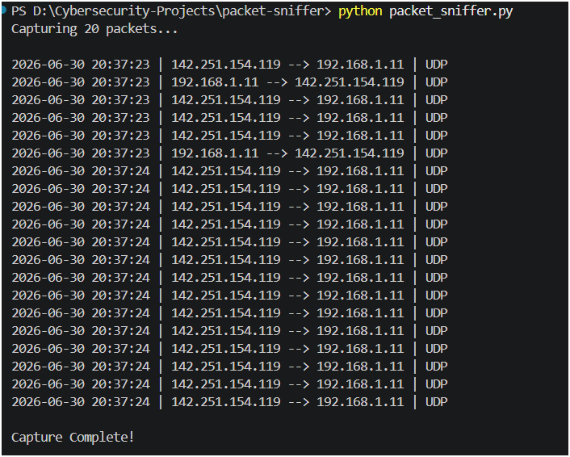
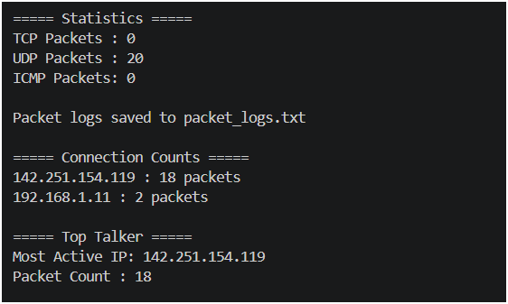
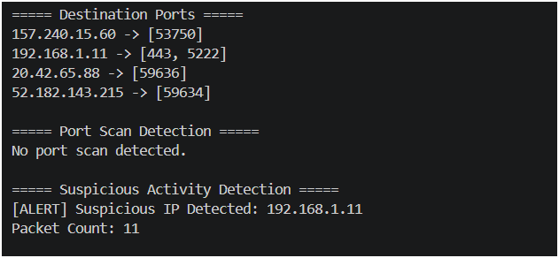
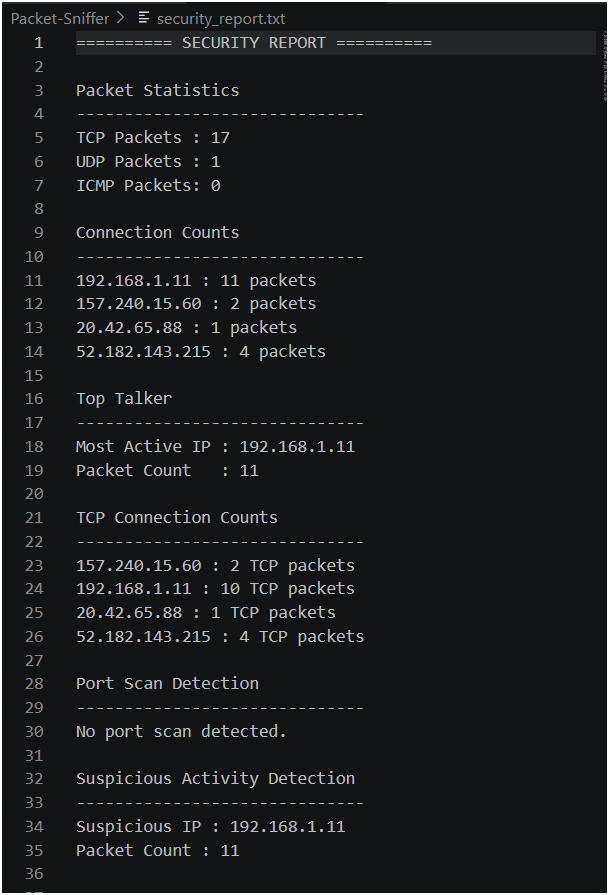
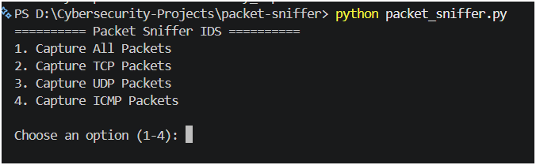
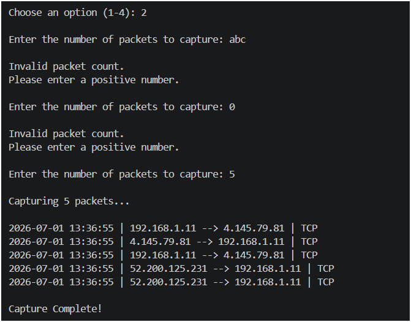
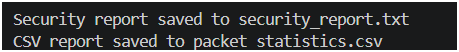
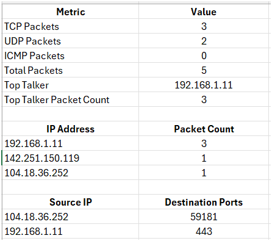

# 🛡️ Packet Sniffer IDS

A Python-based **Packet Sniffer and Intrusion Detection System (IDS)** developed as part of my cybersecurity learning journey. This project captures live network traffic, analyzes packets, detects suspicious activity, and generates multiple security reports.

---

## ✨ Features

### 📡 Packet Monitoring
- Capture live network packets using Scapy
- Display source and destination IP addresses
- Detect network protocols (TCP, UDP, ICMP)
- Interactive protocol selection (All / TCP / UDP / ICMP)
- User-defined packet capture count
- Timestamp every captured packet

### 📊 Traffic Analysis
- Generate packet statistics
- Count connections per IP address
- Identify the most active IP (Top Talker)
- Count TCP connections for each IP
- Track unique destination ports

### 🚨 Security Monitoring
- Detect possible port scans using unique destination ports
- Detect suspicious network activity based on packet thresholds
- Reduce false positives during normal network browsing
- Generate real-time security alerts

### 📝 Logging & Reporting
- Export packet logs to `packet_logs.txt`
- Generate detailed security reports in `security_report.txt`
- Export packet statistics to `packet_statistics.csv`
- Export IP address packet counts
- Export destination port information

---

## 🛠️ Technologies Used

- Python 3
- Scapy
- CSV Module
- Networking Concepts
- Intrusion Detection Concepts

---

## 📂 Project Structure

```text
Packet-Sniffer/
│
├── images/
│   ├── live_capture.png
│   ├── statistics.png
│   ├── port_scan_detection.png
│   ├── security_report.png
│   ├── v13_menu.png
│   ├── v13_packet_count.png
│   ├── v14_csv_terminal.png
│   └── v14_csv_excel.png
│
├── packet_sniffer.py
├── packet_logs.txt
├── security_report.txt
├── packet_statistics.csv
├── README.md
└── .gitignore
```

---

## ▶️ How to Run

### Clone the repository

```bash
git clone https://github.com/Himandi-Asirini/Packet-Sniffer-IDS.git
```

### Navigate into the project

```bash
cd Packet-Sniffer-IDS
```

### Install dependencies

```bash
pip install scapy
```

### Run the program

```bash
python packet_sniffer.py
```

---

## 📈 Current Version

**Version 14**

### ✅ Implemented Features

- Live Packet Capture
- Interactive Protocol Selection
- User-defined Packet Capture Count
- Menu Input Validation
- Packet Count Validation Loop
- Timestamp Logging
- TCP / UDP / ICMP Detection
- Packet Statistics
- Connection Counts
- Top Talker Detection
- TCP Connection Counting
- Unique Destination Port Tracking
- Improved Port Scan Detection
- Suspicious Activity Detection
- Packet Log Export
- Security Report Generation
- CSV Report Export

---

## 📜 Version History

### Version 10
- Live packet capture
- Packet statistics
- Connection counting
- Top Talker detection
- Packet logging
- Security report generation

### Version 11
- TCP connection counting
- Basic TCP threshold-based port scan detection

### Version 12
- Unique destination port tracking
- Improved port scan detection using unique destination ports
- Reduced false positives during normal HTTPS traffic

### Version 13
- Interactive packet capture menu
- Protocol filtering (All, TCP, UDP, ICMP)
- User-selectable packet capture count
- Menu input validation
- Packet count validation with retry loop

### Version 14
- CSV report export
- Export packet statistics
- Export IP address packet counts
- Export destination port information

---

## 🚀 Future Improvements

- JSON report export
- Dashboard for live traffic visualization
- Packet filtering by IP address
- SYN scan detection
- Email alert notifications
- GeoIP lookup for external IP addresses
- Command-line argument support
- Continuous packet monitoring mode

---

## 📸 Screenshots

### Live Packet Capture



---

### Traffic Statistics



---

### Port Scan Detection



---

### Security Report



---

### Interactive Capture Menu



---

### Packet Count Validation



---

### CSV Report Export



---

### CSV Report Preview



---

## 👩‍💻 Author

**Himandi Asirini**

Cyber Security Undergraduate | Python Developer | Network Security Enthusiast